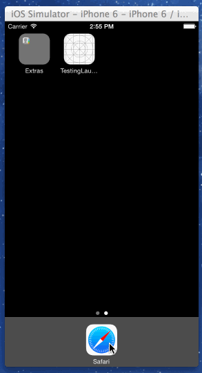

#Profile Sharing SDK

###Project Goal
Use a custom SDK to open native PayPal login screen with the help of Profile Sharing use case by [PayPal iOS SDK](https://github.com/paypal/PayPal-iOS-SDK). After successful login, the goal is to transition to `NextViewController`. 

###Current Issues

1. There is no smooth transition to `NextViewController` after successful login. Refer to the animation below.

2. Use a completion handler (instead of delegation) to update the current view with *success* message. I have asked the same question on StackOverFlow, with a simplified example - http://stackoverflow.com/questions/26165235/update-completion-handler-outside-declared-method

3. A suggestion of eliminating the `PayPalViewController` from SDK, and replace it by a class derived from `NSObject`. Ideally, the `getUserPayPalAuthorization:completion:` method should not belong to a view controller class, but to some other class — such as a general utility class (derived from `NSObject`).

###Animation 

###Instructions for building the reference implementation -

1) Open `TestingLaunchPayPalSDK.xcodeproj` in [Xcode Version 6.0.1](https://itunes.apple.com/us/app/xcode/id497799835?ls=1&mt=12) or later. 

2) Build the project Command (⌘) + R

3) Enter mock data as your credentials. The `PayPalNoNetwork` environment is enabled.

4) After entering credentials, the 'success' keyword is intercepted. Notice transition to `NextViewController` of the SampleApp.

###Instructions for building a universal binary

1) Open LaunchPayPalSDK.xcodeproj in Xcode 6.0.1 or later. Make sure you choose the 'UniversalLibrary' scheme.

2) Build the project Command (⌘) + R

3) Under Products, right click on `libLaunchPayPalSDK.a`. Choose `Debug-universal` folder.

4) Link the `libLaunchPayPalSDK.a` and `PayPalViewController.h` to your reference implementation.

###Response

This authorization response is a NSDictionary object which can be seen in a debug window. Example:

     Response:  
    {
        client =     {
            environment = mock;
            "paypal_sdk_version" = "2.3.2";
            platform = iOS;
            "product_name" = "PayPal iOS SDK";
        };
        response =     {
            code = "EJhi9jOPswug9TDOv93qg4Y28xIlqPDpAoqd7biDLpeGCPvORHjP1Fh4CbFPgKMGCHejdDwe9w1uDWnjPCp1lkaFBjVmjvjpFtnr6z1YeBbmfZYqa9faQT_71dmgZhMIFVkbi4yO7hk0LBHXt_wtdsw";
        };
        "response_type" = "authorization_code";
    }

